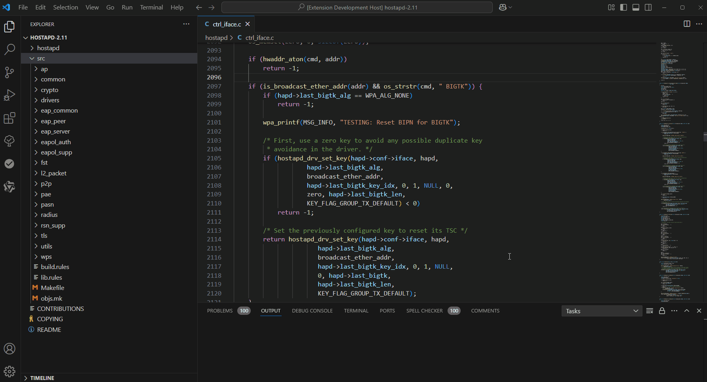
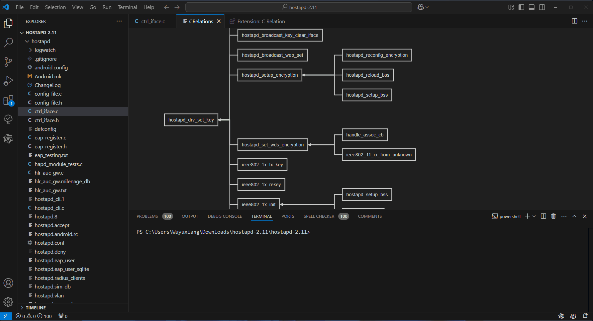

# C Relation VS Code Extension

C Language Call Chain Visualization Plugin.

## Details

This plugin is used to visualize the call chain of C language programs.

How to use:

1. Open your C language project.

2. Open the command palette (Ctrl+Shift+P) and select `C Relation: Init database`. The first time will take a while to scan the entire project and build the database.

3. **Select** a function name, then open the right-click menu and select `Show Relations`. You can see the call chain of the function in a new panel.

If you want to show relations using a shortcut key, you can add the following code to your `keybindings.json` file. For example: 

```
{
    "key": "ctrl+alt+r",
    "command": "crelation.showRelations",
    "when": "editorTextFocus && editorHasSelection"
}
```

4. In the new panel, you can click the function name to collapse or expand the call chain. Moreover, you can right-click the function name to jump directly to the function code. If there are too many tree nodes, you can drag the tree to make it easier to read.





5. If you have modified the C language project, you can update the database by running the command `C Relation: Update database`. It will only scan the modified files. If you want to rebuild the entire database, you can run the command `C Relation: Force update database`.

## Issues
If you have any questions, please contact me on [GitHub](https://github.com/SingleMoonlight/crelation).

Before asking questions, please open the VS Code output panel and check the `C Relation` log. It's better if you can open `Help` -> `Toggle Developer Tools` to see if there are any errors. This will help me solve your problem faster.

## Q&A
1. command 'crelation.init' not found

If you encounter this problem, it's most likely because you're using the extension on a Linux system that does not support GLIBCXX_3.4.29.

You can use `strings /usr/lib/x86_64-linux-gnu/libstdc++.so.6 | grep GLIBCXX` to check the version of GLIBCXX. If the version is lower than 3.4.29, you can try to install a newer version of GLIBCXX. There is no good solution for this problem at present.

2. Incorrect parsing of macros nested with logical expressions
For example:
```c
if (
#ifdef TEST_MACRO
    !func() &&
#endif
    boolean_expression)
{
    // do something
}
```

This is a known limitation of tree-sitter-c. I have submitted an issue to the tree-sitter-c repository. However, I don't know when it will be fixed.

This bug has a small probability of affecting the parsing results, manifested as the caller of a function being displayed as global, but it does not affect the jump function.


## Features

### Activation Events
+ onStartupFinished

### Commands

| ID                      | Title                            | Description                               |
| ----------------------- | -------------------------------- | ----------------------------------------- |
| crelation.init          | C Relation: Init database         | Scan the project and build the database   |
| crelation.update        | C Relation: Update database       | Scan the changed file and update database |
| crelation.forceUpdate   | C Relation: Force update database | Scan the project and rebuild the database |
| crelation.showRelations | Show Relations                   | Show the function call                    |

### Settings

| ID                     | Description                        | Default                 |
| ---------------------- | ---------------------------------- | ----------------------- |
| crelation.dataSavePath | The path to save the database file | `<username>/.crelation` |
| crelation.autoInitDatabase | Whether to init the database automatically when opening a project | `off` |
| crelation.autoUpdateInterval | The interval to update the database automatically when opening a project. The unit is minutes. Default is 0, which means no auto update. Changed value will take effect after **REBOOT** the VS Code. | 0 |
| crelation.relationsPosition | The position of the relations shown | `default` |
| crelation.relationsPanelMode | The mode of the relations panel.                             | `multiple`              |
| crelation.logLevel     | The log level of the extension     | `error`                   |
