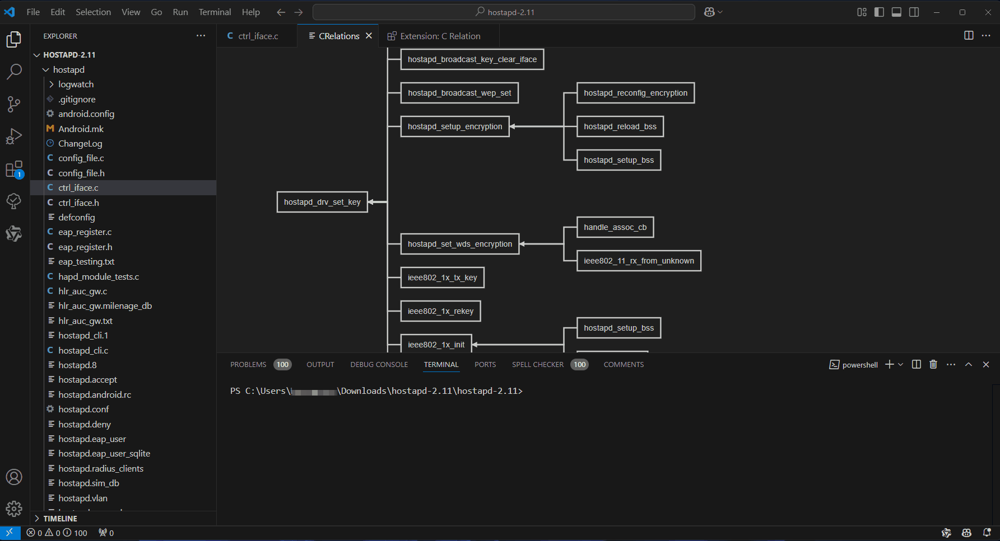

# C Relation VS Code Extension

C Language Call Chain Visualization Plugin.

## Details

This plugin is used to visualize the call chain of the C language program.

How to use:

1.Open your C language project.

2.Open the command palette (Ctrl+Shift+P) and select `C Relation: Init database`. The first time it will take a long time to scan the whole project and build the database.

3.**Select** a function name and then open right click menu and select `Show Relations`. You can see the call chain of the function in a new panel.

If you want show relations by a shortcut key, you can add the following code to your `keybindings.json` file. For example: 

```
{
    "key": "ctrl+alt+r",
    "command": "crelation.showRelations",
    "when": "editorTextFocus && editorHasSelection"
}
```

4.In the new panel, you can click the function name to collapse or expand the call chain. Moreover, it will just jump to the function code when you right click the function name. If the tree nodes are too many, you can drag the tree to make it easier to read.




5.If you have modified the C language project, you can update the database by running the command `C Relation: Update database`. It will only scan the updated files. If you want to update the whole database, you can run the command `C Relation: Force update database`.

## Issues
If you have any questions, please contact me at [GitHub](https://github.com/SingleMoonlight/crelation).

Before asking questions, please open the VS Code output panel and check the log. It's better if you can open `Help` -> `Toggle Developer Tools` to see if there are any errors. It will help me to solve your problem.

## Q&A
1.command 'crelation.init' not found

If you encounter this problem, it most be because you uses the extension in some Linux system which is not supported GLIBCXX_3.4.29. 

You can use `strings /usr/lib/x86_64-linux-gnu/libstdc++.so.6 | grep GLIBCXX` to check the version of GLIBCXX. If the version is lower than 3.4.29, you can try to install a newer version of GLIBCXX. There is no a good solution for this problem at present.

## Features

### Activation Events
+ onStartupFinished

### Commands

| ID                      | Title                            | Description                               |
| ----------------------- | -------------------------------- | ----------------------------------------- |
| crelation.init          | C Relation: Init database         | Scan the project and build the database   |
| crelation.update        | C Relation: Update database       | Scan the changed file and update database |
| crelation.forceUpdate   | C Relation: Force update database | Scan the project and rebuild the database |
| crelation.showRelations | Show Relations                   | Show the function call                    |

### Settings

| ID                     | Description                        | Default                 |
| ---------------------- | ---------------------------------- | ----------------------- |
| crelation.dataSavePath | The path to save the database file | `<username>/.crelation` |
| crelation.showRelationsInSecondColumn | Whether to show relations in the second column editor | `off` |
| crelation.autoInitDatabase     | Whether to init the database automatically when opening a project     | `off`                   |
| crelation.logLevel     | The log level of the extension     | `error`                   |
